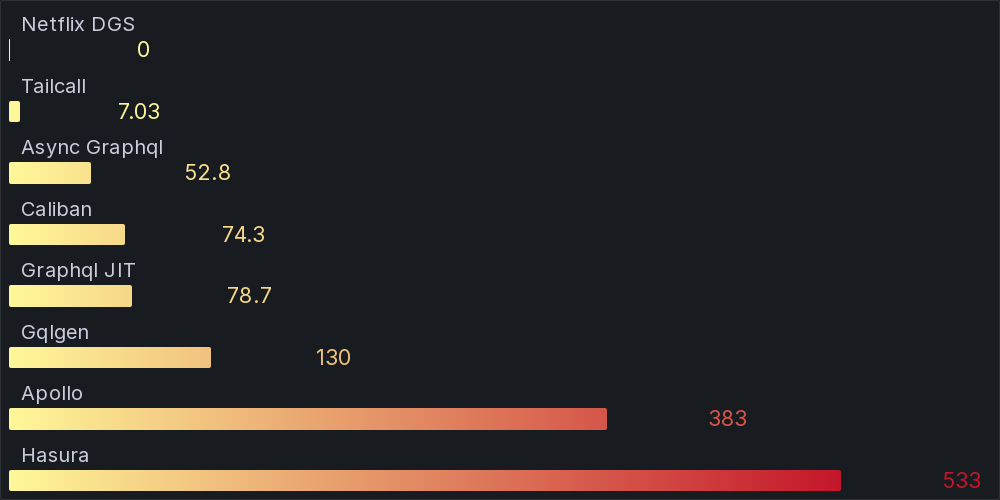
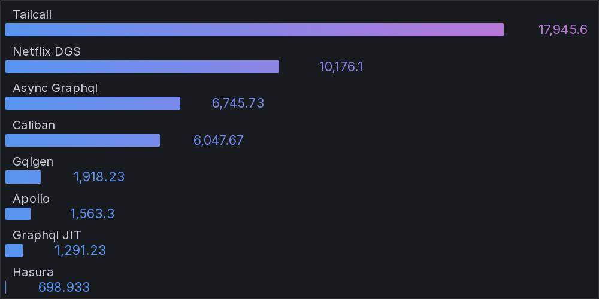

# GraphQL Benchmarks <!-- omit from toc -->

[](https://codespaces.new/tailcallhq/graphql-benchmarks)

Explore and compare the performance of the fastest GraphQL frameworks through our comprehensive benchmarks.

- [Introduction](#introduction)
- [Quick Start](#quick-start)
- [Benchmark Results](#benchmark-results)
- [Architecture](#architecture)
  - [K6](#k6)
  - [GraphQL](#graphql)
  - [Nginx](#nginx)
  - [Jsonplaceholder](#jsonplaceholder)
- [GraphQL Schema](#graphql-schema)
- [Contribute](#contribute)

[Tailcall]: https://github.com/tailcallhq/tailcall
[Gqlgen]: https://github.com/99designs/gqlgen
[Apollo GraphQL]: https://github.com/apollographql/apollo-server
[Netflix DGS]: https://github.com/netflix/dgs-framework
[Caliban]: https://github.com/ghostdogpr/caliban
[async-graphql]: https://github.com/async-graphql/async-graphql
[Hasura]: https://github.com/hasura/graphql-engine
[GraphQL JIT]: https://github.com/zalando-incubator/graphql-jit

## Introduction

This document presents a comparative analysis of several renowned GraphQL frameworks. Dive deep into the performance metrics, and get insights into their throughput and latency.

> **NOTE:** This is a work in progress suite of benchmarks, and we would appreciate help from the community to add more frameworks or tune the existing ones for better performance.

## Quick Start

Get started with the benchmarks:

1. Click on this [link](https://codespaces.new/tailcallhq/graphql-benchmarks) to set up on GitHub Codespaces.
2. Once set up in Codespaces, initiate the benchmark tests:

```bash
./setup.sh
./run_benchmarks.sh
```

## Benchmark Results

| Throughput (Higher is better) | Latency (Lower is better) | 
|-------:|--------:|
|  `{{ posts { id userId title user { id name email }}}}` |
|  |  |
|  `{ posts { title }}` |
|  |  |
|  `{greet}` |
|  |  |

<!-- PERFORMANCE_RESULTS_START -->

| Query | Server | Requests/sec | Latency (ms) | Relative |
|-------:|--------:|--------------:|--------------:|---------:|
| 1 | `{ posts { id userId title user { id name email }}}` |
|| [Tailcall] | `13,954.10` | `7.03` | `75.07x` |
|| [Netflix DGS] | `10,786.10` | `0.00` | `58.03x` |
|| [async-graphql] | `1,887.90` | `52.76` | `10.16x` |
|| [Caliban] | `1,343.40` | `74.31` | `7.23x` |
|| [GraphQL JIT] | `1,268.06` | `78.65` | `6.82x` |
|| [Gqlgen] | `769.26` | `129.54` | `4.14x` |
|| [Apollo GraphQL] | `258.91` | `383.16` | `1.39x` |
|| [Hasura] | `185.88` | `532.79` | `1.00x` |
| 2 | `{ posts { title }}` |
|| [Tailcall] | `17,943.30` | `5.39` | `25.92x` |
|| [Netflix DGS] | `10,332.40` | `0.00` | `14.92x` |
|| [async-graphql] | `6,629.00` | `14.87` | `9.58x` |
|| [Caliban] | `6,047.17` | `16.11` | `8.73x` |
|| [Gqlgen] | `1,899.97` | `52.31` | `2.74x` |
|| [Apollo GraphQL] | `1,554.33` | `63.95` | `2.25x` |
|| [GraphQL JIT] | `1,296.20` | `76.66` | `1.87x` |
|| [Hasura] | `692.30` | `142.86` | `1.00x` |
| 3 | `{ greet }` |
|| [Tailcall] | `17,945.60` | `5.38` | `25.68x` |
|| [Netflix DGS] | `10,176.10` | `0.00` | `14.56x` |
|| [async-graphql] | `6,745.73` | `14.61` | `9.65x` |
|| [Caliban] | `6,047.67` | `16.14` | `8.65x` |
|| [Gqlgen] | `1,918.23` | `51.79` | `2.74x` |
|| [Apollo GraphQL] | `1,563.30` | `63.52` | `2.24x` |
|| [GraphQL JIT] | `1,291.23` | `77.02` | `1.85x` |
|| [Hasura] | `698.93` | `141.88` | `1.00x` |

<!-- PERFORMANCE_RESULTS_END -->

## Architecture


A client (`k6`) sends requests to a GraphQL server to fetch post titles. The GraphQL server, in turn, retrieves data from an external source, `jsonplaceholder.typicode.com`, routed through the `nginx` reverse proxy.

### K6

`k6` serves as our test client, sending GraphQL requests at a high rate.

### GraphQL

Our tested GraphQL server. We evaluated various implementations, ensuring no caching on the GraphQL server side.

### Nginx

A reverse-proxy that caches every response, mitigating rate-limiting and reducing network uncertainties.

### Jsonplaceholder

The primary upstream service forming the base for our GraphQL API. We query its `/posts` API via the GraphQL server.

## GraphQL Schema

Inspect the generated GraphQL schema employed for the benchmarks:

```graphql
schema {
  query: Query
}

type Query {
  posts: [Post]
}

type Post {
  id: Int!
  userId: Int!
  title: String!
  body: String!
  user: User
}

type User {
  id: Int!
  name: String!
  username: String!
  email: String!
  phone: String
  website: String
}
```

## Contribute

Your insights are invaluable! Test these benchmarks, share feedback, or contribute by adding more GraphQL frameworks or refining existing ones. Open an issue or a pull request, and let's build a robust benchmarking resource together!
