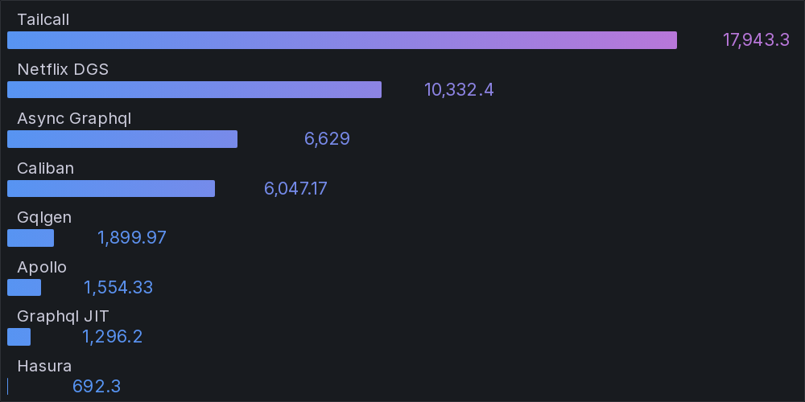

# GraphQL Benchmarks <!-- omit from toc -->

[](https://codespaces.new/tailcallhq/graphql-benchmarks)

Explore and compare the performance of the fastest GraphQL frameworks through our comprehensive benchmarks.

- [Introduction](#introduction)
- [Quick Start](#quick-start)
- [Benchmark Results](#benchmark-results)
- [Architecture](#architecture)
  - [K6](#k6)
  - [GraphQL](#graphql)
  - [Nginx](#nginx)
  - [Jsonplaceholder](#jsonplaceholder)
- [GraphQL Schema](#graphql-schema)
- [Contribute](#contribute)

[Tailcall]: https://github.com/tailcallhq/tailcall
[Gqlgen]: https://github.com/99designs/gqlgen
[Apollo GraphQL]: https://github.com/apollographql/apollo-server
[Netflix DGS]: https://github.com/netflix/dgs-framework
[Caliban]: https://github.com/ghostdogpr/caliban
[async-graphql]: https://github.com/async-graphql/async-graphql
[Hasura]: https://github.com/hasura/graphql-engine
[GraphQL JIT]: https://github.com/zalando-incubator/graphql-jit

## Introduction

This document presents a comparative analysis of several renowned GraphQL frameworks. Dive deep into the performance metrics, and get insights into their throughput and latency.

> **NOTE:** This is a work in progress suite of benchmarks, and we would appreciate help from the community to add more frameworks or tune the existing ones for better performance.

## Quick Start

Get started with the benchmarks:

1. Click on this [link](https://codespaces.new/tailcallhq/graphql-benchmarks) to set up on GitHub Codespaces.
2. Once set up in Codespaces, initiate the benchmark tests:

```bash
./setup.sh
./run_benchmarks.sh
```

## Benchmark Results

| Throughput (Higher is better) | Latency (Lower is better) | 
|-------:|--------:|
|  `{{ posts { id userId title user { id name email }}}}` |
|  |  |
|  `{ posts { title }}` |
|  |  |
|  `{greet}` |
|  |  |

<!-- PERFORMANCE_RESULTS_START -->

| Query | Server | Requests/sec | Latency (ms) | Relative |
|-------:|--------:|--------------:|--------------:|---------:|
| 1 | `{ posts { id userId title user { id name email }}}` |
|| [Tailcall] | `13,295.60` | `7.37` | `88.75x` |
|| [Netflix DGS] | `10,758.70` | `0.00` | `71.82x` |
|| [async-graphql] | `1,796.80` | `55.45` | `11.99x` |
|| [Caliban] | `1,404.90` | `71.05` | `9.38x` |
|| [GraphQL JIT] | `1,199.61` | `83.15` | `8.01x` |
|| [Gqlgen] | `742.81` | `134.14` | `4.96x` |
|| [Apollo GraphQL] | `254.93` | `389.55` | `1.70x` |
|| [Hasura] | `149.81` | `695.79` | `1.00x` |
| 2 | `{ posts { title }}` |
|| [Tailcall] | `17,776.30` | `5.42` | `22.55x` |
|| [Netflix DGS] | `10,710.20` | `0.00` | `13.59x` |
|| [Caliban] | `6,523.63` | `14.96` | `8.28x` |
|| [async-graphql] | `6,334.90` | `15.55` | `8.04x` |
|| [Gqlgen] | `1,835.97` | `54.10` | `2.33x` |
|| [Apollo GraphQL] | `1,516.83` | `65.45` | `1.92x` |
|| [GraphQL JIT] | `1,241.40` | `80.04` | `1.57x` |
|| [Hasura] | `788.23` | `125.84` | `1.00x` |
| 3 | `{ greet }` |
|| [Tailcall] | `17,841.10` | `5.40` | `22.39x` |
|| [Netflix DGS] | `10,901.10` | `0.00` | `13.68x` |
|| [Caliban] | `6,545.03` | `14.89` | `8.21x` |
|| [async-graphql] | `6,342.07` | `15.53` | `7.96x` |
|| [Gqlgen] | `1,889.27` | `52.58` | `2.37x` |
|| [Apollo GraphQL] | `1,470.80` | `67.54` | `1.85x` |
|| [GraphQL JIT] | `1,257.77` | `79.06` | `1.58x` |
|| [Hasura] | `796.83` | `124.46` | `1.00x` |

<!-- PERFORMANCE_RESULTS_END -->

## Architecture


A client (`k6`) sends requests to a GraphQL server to fetch post titles. The GraphQL server, in turn, retrieves data from an external source, `jsonplaceholder.typicode.com`, routed through the `nginx` reverse proxy.

### K6

`k6` serves as our test client, sending GraphQL requests at a high rate.

### GraphQL

Our tested GraphQL server. We evaluated various implementations, ensuring no caching on the GraphQL server side.

### Nginx

A reverse-proxy that caches every response, mitigating rate-limiting and reducing network uncertainties.

### Jsonplaceholder

The primary upstream service forming the base for our GraphQL API. We query its `/posts` API via the GraphQL server.

## GraphQL Schema

Inspect the generated GraphQL schema employed for the benchmarks:

```graphql
schema {
  query: Query
}

type Query {
  posts: [Post]
}

type Post {
  id: Int!
  userId: Int!
  title: String!
  body: String!
  user: User
}

type User {
  id: Int!
  name: String!
  username: String!
  email: String!
  phone: String
  website: String
}
```

## Contribute

Your insights are invaluable! Test these benchmarks, share feedback, or contribute by adding more GraphQL frameworks or refining existing ones. Open an issue or a pull request, and let's build a robust benchmarking resource together!
